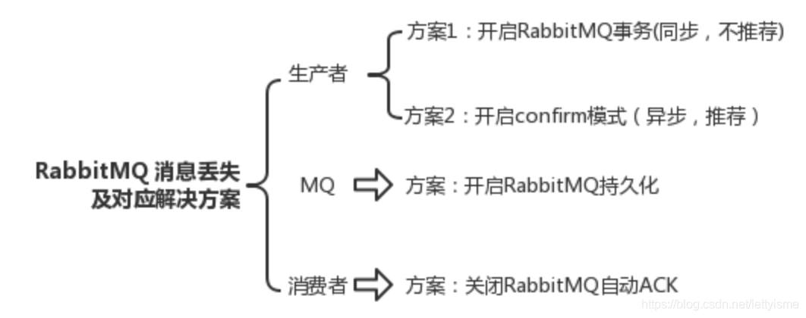

# 常见中间件消息队列面试题

## 为什么要使用MQ？

解耦、削峰、异步

### 解耦

在微服务架构体系中，微服务A需要与微服务B进行通信，传统的做法是A调用B的接口。但这样做如果系统B无法访问或连接超时，系统A需要等待，直到系统B做出响应，并且A与B存在严重的耦合现象。如果引入消息队列进行系统AB的通信，流程是这样的：

- 系统A将消息存储到消息队列中，返回成功信息
- 系统B从队列中获取消息，进行处理操作
- 系统A将消息放到队列中，就不用关心系统B是否可以获取等其他事情了，实现了两个系统间的解耦。

使用场景：

短信、邮件通知

### 削峰

系统A每秒请求100个，系统可以稳定运行，但如果在秒杀活动中，每秒并发达到1w个，但系统最大处理能力只能每秒处理 1000 个，所以，在秒杀活动中，系统服务器会出现宕机的现象。如果引入 MQ ，可以解决这个问题。每秒 1w个请求会导致系统崩溃，那我们让用户发送的请求都存储到队列中，由于系统最大处理能力是每秒1000个请求，让系统A每秒只从队列中拉取1000个请求，保证系统能稳定运行，在秒杀期间，请求大量进入到队列，积压到MQ中，而系统每秒只从队列中取1000个请求处理。这种短暂的高峰期积压是没问题的，因为高峰期一旦过去，每秒请求数迅速递减，而系统每秒还是从队列中取1000个请求进行处理，系统会快速将积压的消息消费掉。

使用场景：

秒杀活动
团抢活动

### 异步

用户注册，需要发送注册邮件和注册短信，传统的做法有两种：串行、并行。

- 串行方式：将注册信息写库后（50ms），发送邮件（50ms），再发送短信（50ms），任务完成后，返回客户端，共耗时（150ms）
- 并行方式：将注册信息写库后（50ms），开启子线程让发送邮件和发送短信同时进行（50ms），返回客户端，共耗时（100ms）
- 引入MQ，将注册信息写库（50ms），将发送邮件和短信的操作写入队列（5ms），返回客户端，而消费者什么时候从队列中取消息进行处理，不用关心，共耗时（55ms）

使用场景：

将不是必须等待响应结果的业务逻辑进行异步处理

## MQ有什么优缺点？

优点上面已经说了，就是在特殊场景下有其对应的好处，解耦、异步、削峰。

缺点有以下几个：

- **系统可用性降低** 系统引入的外部依赖越多，越容易挂掉。万一 MQ 挂了，MQ 一挂，整套系统崩溃，你不就完了？
- **系统复杂度提高** 硬生生加个 MQ 进来，你怎么保证消息没有重复消费？怎么处理消息丢失的情况？怎么保证消息传递的顺序性？问题一大堆。
- **一致性问题** A 系统处理完了直接返回成功了，人都以为你这个请求就成功了；但是问题是，要是BCD 三个系统那里，BD 两个系统写库成功了，结果 C 系统写库失败了，咋整？你这数据就不一致了。

## 如何保证消息的可靠传输？如果消息丢了怎么办？

数据的丢失问题，可能出现在生产者、MQ、消费者中。

- **生产者丢失**：生产者将数据发送到 RabbitMQ 的时候，可能数据就在半路给搞丢了，因为网络问题啥的，都有可能。

此时可以选择用 RabbitMQ 提供的事务功能，就是生产者发送数据之前开启RabbitMQ 事务channel.txSelect，然后发送消息，如果消息没有成功被 RabbitMQ 接收到，那么生产者会收到异常报错，此时就可以回滚事务channel.txRollback，然后重试发送消息；如果收到了消息，那么可以提交事务channel.txCommit。吞吐量会下来，因为太耗性能。

所以一般来说，如果你要确保说写 RabbitMQ 的消息别丢，可以开启confirm模式，在生产者那里设置开启confirm模式之后，你每次写的消息都会分配一个唯一的 id，然后如果写入了 RabbitMQ 中，RabbitMQ 会给你回传一个ack消息，告诉你说这个消息 ok 了。如果 RabbitMQ 没能处理这个消息，会回调你一个nack接口，告诉你这个消息接收失败，你可以重试。而且你可以结合这个机制自己在内存里维护每个消息 id 的状态，如果超过一定时间还没接收到这个消息的回调，那么你可以重发。事务机制和cnofirm机制最大的不同在于，事务机制是同步的，你提交一个事务之后会阻塞在那儿，但是confirm机制是异步的，你发送个消息之后就可以发送下一个消息，然后那个消息RabbitMQ 接收了之后会异步回调你一个接口通知你这个消息接收到了。所以一般在生产者这块避免数据丢失，都是用confirm机制的。

- **MQ中丢失**：就是 RabbitMQ 自己弄丢了数据，这个你必须开启 RabbitMQ 的持久化，就是消息写入之后会持久化到磁盘，哪怕是 RabbitMQ 自己挂了，恢复之后会自动读取之前存储的数据，一般数据不会丢。

设置持久化有两个步骤：创建 queue 的时候将其设置为持久化，这样就可以保证RabbitMQ 持久化 queue 的元数据，但是不会持久化 queue 里的数据。第二个是发送消息的时候将消息的 deliveryMode 设置为 2，就是将消息设置为持久化的，此时 RabbitMQ 就会将消息持久化到磁盘上去。必须要同时设置这两个持久化才行，RabbitMQ 哪怕是挂了，再次重启，也会从磁盘上重启恢复 queue，恢复这个 queue 里的数据。

持久化可以跟生产者那边的confirm机制配合起来，只有消息被持久化到磁盘之后，才会通知生产者ack了，所以哪怕是在持久化到磁盘之前，RabbitMQ 挂了，数据丢了，生产者收不到ack，你也是可以自己重发的。注意，哪怕是你给RabbitMQ 开启了持久化机制，也有一种可能，就是这个消息写到了 RabbitMQ 中，但是还没来得及持久化到磁盘上，结果不巧，此时 RabbitMQ 挂了，就会导致内存里的一点点数据丢失。

- **消费端丢失**：你消费的时候，刚消费到，还没处理，结果进程挂了，比如重启了，那么就尴尬了，RabbitMQ 认为你都消费了，这数据就丢了。**这个时候得用 RabbitMQ 提供的ack机制，简单来说，就是你关闭 RabbitMQ 的自动ack**，可以通过一个 api 来调用就行，然后每次你自己代码里确保处理完的时候，再在程序里ack一把。这样的话，如果你还没处理完，不就没有ack？那RabbitMQ 就认为你还没处理完，这个时候 RabbitMQ 会把这个消费分配给别的 consumer 去处理，消息是不会丢的。

